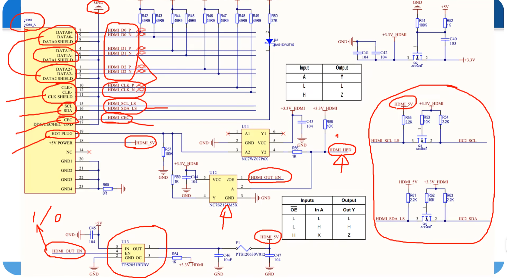
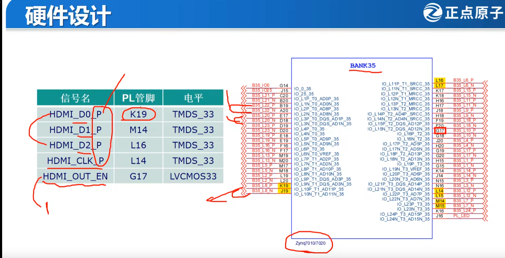

# HDMI

HDMI   是新一代的多媒体接口标准

HIgh——Definition Multimedia Interface

能够同时·传输视频和音频简化设备接口和连线   ------提供了更高的数据传输带宽5Gps -48Gps。传输的是纯数字信号，包括音频和视频。

HDMI向下兼容DV I（数字视频接口）接口，在物理层面均使用TMDS标准音视频数据。

TMDS——最小化传输差分信号（一种高速数据传输技术，使用差分信号传输高速串行数据）

使用两个引脚来传输一路信号，利用两个引脚的电压值的正负极和大小来决定数据是0或1.

TMDS的连接（从视频和音频源传输到终端）

一共有4个通道

channel0（Pixel Data Blue像素数据）

channel1（Pixel Data Green像素数据）

channel2（Pixel Data Red像素数据）

channel3（Clock Channel 时钟通道）

TMDS连接从逻辑功能上可以划分为两个阶段“编解码”和“并/串转换”

“编解码”：在编码阶段，将像素数据、HDMI的音频/附加数据、行同步和厂同步信号分别编码成10位的字符流。

”并串转换“：将上述10位字符流转换成串行数据从3个通道发送出去。

并转串生成的串行数据速率是实际像素时钟速率的10倍。

HDMI编码机制

guardband（保护带）-->  实际视频数据-->    preamble(前导)

ATK-ZYNQ7010_HDMI管脚分配图

